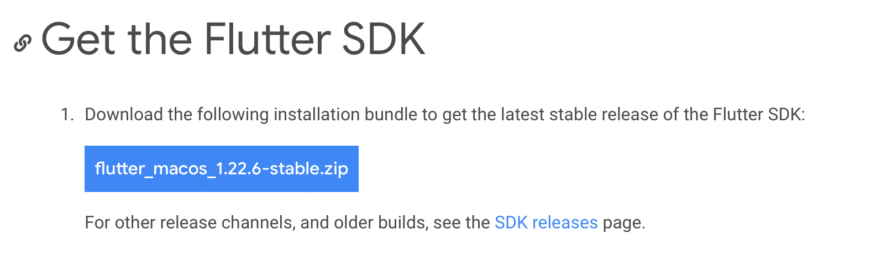
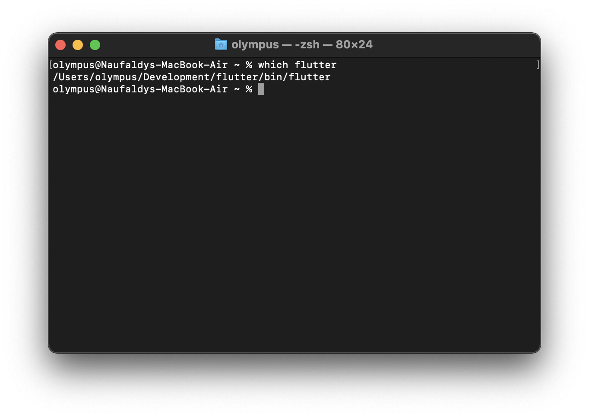

# Cara install flutter

[Referensi](https://flutter.dev/docs/get-started/install)

---

## MacOS
> Spesifikasi minimal
> 1. Penyimpanan 2.8 GB (Rekomendasi minimal 10 GB)
> 2. MacOS 64-Bit (M1 sudah bisa di gunakan)
> 3. Tools
>  a. Git
>  b. Xcode

---

1. Menuju [link ini](https://flutter.dev/docs/get-started/install/macos "Install flutter Mac OS")

2. Extract file zip (Rekomendasi : Buat folder Development baru di home, Contoh : /home/Development)
3. Update environment
   1. Jika menggunakan Bash maka gunakan command "nano .bashrc"
   2. Jika menggunakan zsh maka gunakan command "nano .zshrc"
   3. Tambahkan command dibawah pada file rc yang tadi : 
   > export PATH="$PATH:[PATH_TO_FLUTTER_GIT_DIRECTORY]/flutter/bin"
    
    Contoh :
    >  export PATH="$PATH:/Users/olympus/Development/flutter/bin"

    4. jalankan command : "source .zshrc" atau "source .bashrc"
    5. Verifikasi flutter sudah terinstall dengan cmd, jalankan command berikut : "echo $PATH" jika sudah terlihat /flutter/bin maka flutter berhasil terinstall
    6. jalankan command berikut untuk verfikasi dimana flutter yang dimaksud : "which flutter"
   > 